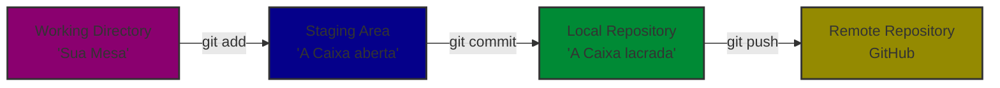

# Aula: O Universo do Versionamento com Git e GitHub 🚀

**Disciplina:** Introdução a Programação  
**Foco:** O Primeiro Contato com Git e GitHub (Do Zero ao Primeiro Push) 

---

## 1. O que é Controle de Versão? (A Analogia do Jogo) 🎮

Se você já jogou um videogame de RPG ou aventura, sabe o quão importante é a mecânica de **salvar o Jogo (save game)**. Antes de enfrentar um chefe difícil ou tomar uma decisão arriscada, você salva o seu progresso. Se tudo der errado, você não perde o jogo inteiro; basta voltar ao último ponto salvo.

Em programação, o **Git** funciona exatamente assim. Ele é o nosso sistema de *Save Game* para código.

### 🛑 O Problema do Jeito Antigo
Sem o Git, quando queremos testar uma ideia nova no código, costumamos duplicar arquivos ou pastas manualmente:
* `projeto_final.py`
* `projeto_final_v2.py`
* `projeto_final_AGORA_VAI.py`
* `projeto_final_copia_backup_ultimo.py`

Isso gera caos, perda de arquivos e uma confusão imensa quando trabalhamos em equipe.

### 💡 A Solução com Git
O Git gerencia o histórico de um único arquivo (ou conjunto de arquivos) ao longo do tempo. Em vez de criar cópias da pasta, o Git cria uma "linha do tempo" onde cada ponto marcante é registrado com segurança.

---

## 2. A Anatomia do Git: O Fluxo das 3 Áreas 🗺️

Para entender o Git, precisamos entender suas três áreas principais de trabalho. Imagine que você está organizando uma **caixa de mudanças**:



* **1. Working Directory (Diretório de Trabalho):** É a sua mesa de trabalho atual. Onde você cria, edita e deleta suas linhas de código em Python. O Git está observando, mas ainda não guardou nada.
* **2. Staging Area (Área de Preparação):** É a caixa de papelão aberta do lado da mesa. Você coloca ali os arquivos que terminou de editar e que quer salvar juntos. É a fase do `git add`.
* **3. Local Repository (Repositório Local):** É quando você fecha a caixa com fita adesiva e escreve uma etiqueta nela ("Função de soma adicionada"). É o `git commit`. Agora está salvo com segurança na memória do seu computador.

---

## 3. Git vs. GitHub: Qual a diferença? 👯

É muito comum confundir os dois no começo, mas eles são ferramentas diferentes que se complementam:

| Característica | Git 🛠️ | GitHub 🌐 |
| :--- | :--- | :--- |
| **O que é?** | Um programa/software de linha de comando. | Uma plataforma/site web na nuvem. |
| **Onde roda?** | Localmente na sua máquina (computador). | Nos servidores do GitHub na internet. |
| **Função Principal** | Gravar o histórico de alterações do seu código. | Hospedar seus repositórios e permitir trabalho em equipe. |
| **Precisa de internet?**| Não. Funciona 100% offline. | Sim. É necessário para enviar e receber códigos. |

---

## 4. O Guia de Comandos Essenciais 💻

Aqui estão os primeiros comandos que você vai usar na sua jornada de programação:

### Configuração Inicial (Apenas na primeira vez)
Antes de começar, o Git precisa saber quem é você para assinar os seus *saves*:
```bash
git config --global user.name "Seu Nome Completo"
git config --global user.email "seu.email@provedor.com"
```

### O Fluxo Diário de Trabalho
1. **Iniciar um repositório:** Transforma uma pasta comum em uma pasta monitorada pelo Git.
   ```bash
   git init
   ```
2. **Verificar o status:** Mostra quem mudou, quem está na área de preparação e o que falta salvar. (Use esse comando o tempo todo!).
   ```bash
   git status
   ```
3. **Adicionar arquivos à Área de Preparação:**
   ```bash
   git add meu_programa.py  # Adiciona um arquivo específico
   git add .                # Adiciona TODOS os arquivos modificados da pasta
   ```
4. **Salvar a versão (Commit):** Cria o ponto na linha do tempo com uma mensagem explicativa.
   ```bash
   git commit -m "Mensagem clara explicando o que foi feito"
   ```
5. **Enviar para a Nuvem (GitHub):** Envia seus commits locais para o repositório online.
   ```bash
   git push origin main
   ```

---

---

## 📝 Caderno de Exercícios

### Parte 1: Questões de Múltipla Escolha (Teóricas)

**1. Um aluno acabou de criar um arquivo chamado `calculadora.py` e escreveu as primeiras linhas de código. Ele quer que o Git comece a acompanhar este arquivo na área de preparação (Staging Area). Qual comando ele deve executar?**
* a) `git init calculadora.py`
* b) `git commit -m "calculadora.py"`
* c) `git add calculadora.py`
* d) `git push calculadora.py`

<details>
<summary><b>👉 Ver Gabarito Oculto</b></summary>
<b>Alternativa Correta: C</b><br>
<b>Explicação:</b> O comando <code>git add</code> move o arquivo do Diretório de Trabalho para a Staging Area (Área de Preparação). O <code>git init</code> apenas inicia o repositório e o <code>git commit</code> salva de fato o arquivo que já deveria estar no Stage.
</details>

---

**2. Utilizando a nossa analogia do "Jogo Salvo" (Save Game), qual comando do Git representa o ato exato de criar um ponto de restauração definitivo na linha do tempo do seu computador?**
* a) `git status`
* b) `git commit`
* c) `git clone`
* d) `git config`

<details>
<summary><b>👉 Ver Gabarito Oculto</b></summary>
<b>Alternativa Correta: B</b><br>
<b>Explicação:</b> O <code>git commit</code> consolida as alterações que estavam na Staging Area e cria uma "foto" (snapshot) permanente no histórico local do projeto.
</details>

---

**3. Qual das seguintes afirmações define CORRETAMENTE a relação entre o Git e o GitHub?**
* a) O Git é o site onde guardamos os códigos e o GitHub é o programa instalado no computador.
* b) O Git e o GitHub são exatamente o mesmo software, mas com nomes diferentes.
* c) O GitHub pode ser utilizado perfeitamente sem o Git instalado na máquina para controlar versões.
* d) O Git é a ferramenta local que gerencia o histórico de versões, enquanto o GitHub é o serviço em nuvem para hospedar e compartilhar esse histórico.

<details>
<summary><b>👉 Ver Gabarito Oculto</b></summary>
<b>Alternativa Correta: D</b><br>
<b>Explicação:</b> O Git é o motor local (ferramenta de controle de versão), enquanto o GitHub atua como a hospedagem em nuvem para esses repositórios Git.
</details>

---

**4. Ao executar o comando `git status`, um estudante percebe que o nome do seu arquivo Python aparece listado na cor vermelha sob o título "Untracked files" (Arquivos não rastreados). O que isso significa na prática?**
* a) O arquivo está com erros de sintaxe Python e não pode ser executado.
* b) O Git sabe que o arquivo existe na pasta, mas ele ainda não foi adicionado ao controle de versão.
* c) O arquivo já foi enviado com sucesso para o GitHub.
* d) O arquivo foi deletado permanentemente do computador.

<details>
<summary><b>👉 Ver Gabarito Oculto</b></summary>
<b>Alternativa Correta: B</b><br>
<b>Explicação:</b> "Untracked" significa exatamente que o arquivo é novo na pasta e o Git ainda não recebeu instruções (via <code>git add</code>) para começar a monitorar suas alterações.
</details>

---

**5. Qual é a utilidade do parâmetro `-m` ao utilizar o comando `git commit -m "Mensagem"`?**
* a) Modificar o nome do arquivo Python que está sendo salvo.
* b) Mover o arquivo diretamente para a nuvem do GitHub.
* c) Inserir uma mensagem curta de descrição sem a necessidade de abrir um editor de texto de fora do terminal.
* d) Mostrar na tela o menu de ajuda do Git.

<details>
<summary><b>👉 Ver Gabarito Oculto</b></summary>
<b>Alternativa Correta: C</b><br>
<b>Explicação:</b> O <code>-m</code> vem de <i>message</i>. Ele permite que você digite a mensagem explicativa do seu commit diretamente na linha de comando.
</details>

---

### Parte 2: Questões Discursivas

**6. Explique, com suas próprias palavras, qual é o problema de tentar controlar as versões de um programa Python utilizando a estratégia de "copiar e colar a pasta do projeto", renomeando-a para `projeto_v1`, `projeto_v2`, etc. Cite pelo menos dois problemas gerados por esse método.**

<details>
<summary><b>👉 Ver Gabarito Oculto</b></summary>
<b>Resposta Esperada:</b><br>
O aluno deve destacar que esse método manual é propenso a erros humanos e consome muito espaço em disco desnecessariamente. Entre os problemas gerados, podem ser citados:
1. Dificuldade de saber exatamente qual alteração foi feita entre a versão 2 e a versão 3 (falta de histórico claro).
2. Impossibilidade de juntar o trabalho de duas pessoas de forma automática (se um colega alterar a <code>v2</code> e outro alterar a <code>v2</code> ao mesmo tempo, um apagará o código do outro).
3. Bagunça visual e risco de deletar ou alterar a pasta errada por engano.
</details>

---

**7. Imagine que você acabou de criar uma função incrível em Python que calcula a média de notas de um aluno. Você rodou `git add .` e depois `git commit -m "Média calculada"`. O seu código já está seguro no GitHub para o seu professor ver? Justifique sua resposta com base nas áreas do Git.**

<details>
<summary><b>👉 Ver Gabarito Oculto</b></summary>
<b>Resposta Esperada:</b><br>
Não, o código ainda não está no GitHub. Quando executamos o <code>git add .</code> e o <code>git commit</code>, estamos salvando as alterações apenas no <b>Repositório Local</b> (na máquina do próprio aluno). Para que o professor consiga ver o código na nuvem, é obrigatório executar o comando <code>git push</code>, que pega os commits locais e os envia para o <b>Repositório Remoto</b> (GitHub).
</details>

---

### Parte 3: Desafios Práticos de Código

*Professor, para estes exercícios orientar os alunos a abrirem o terminal de comandos (Prompt de Comando, PowerShell ou Terminal do VS Code) dentro da pasta onde criaram seus códigos Python.*

#### Desafio 1: O Primeiro Registro
Crie um arquivo chamado `ola_mundo.py` e escreva nele: `print("Olá, Git!")`. Agora, faça com que o Git registre oficialmente este arquivo pela primeira vez localmente. Escreva abaixo a sequência exata de comandos que você digitou no terminal para alcançar esse objetivo (desde a criação do repositório até o salvamento).

<details>
<summary><b>👉 Ver Gabarito Oculto</b></summary>
<b>Sequência de comandos esperada:</b>
<pre><code>git init
git add ola_mundo.py  (ou git add .)
git commit -m "Primeiro commit: adicionando ola_mundo.py"</code></pre>
</details>

---

#### Desafio 2: Investigando o Histórico
Modifique a mensagem de texto do arquivo `ola_mundo.py` para `print("Olá, Git e GitHub atualizado!")`. Salve o arquivo. Agora, execute o comando correto para verificar o status da modificação e prepare o arquivo para o salvamento, mas **não faça o commit ainda**. Escreva os comandos utilizados.

<details>
<summary><b>👉 Ver Gabarito Oculto</b></summary>
<b>Sequência de comandos esperada:</b>
<pre><code>git status            (para ver o arquivo marcado em vermelho como modificado)
git add ola_mundo.py  (ou git add .)
git status            (opcional - para ver que o arquivo agora está verde, pronto para o commit)</code></pre>
</details>

---

#### Desafio 3: O Commit Final
Agora que seu arquivo modificado no Desafio 2 já está na Área de Preparação (Staging Area), finalize o processo criando um commit com a mensagem `"Atualizando o texto do ola mundo"`. Qual comando você utilizou?

<details>
<summary><b>👉 Ver Gabarito Oculto</b></summary>
<b>Comando esperado:</b>
<pre><code>git commit -m "Atualizando o texto do ola mundo"</code></pre>
</details>
